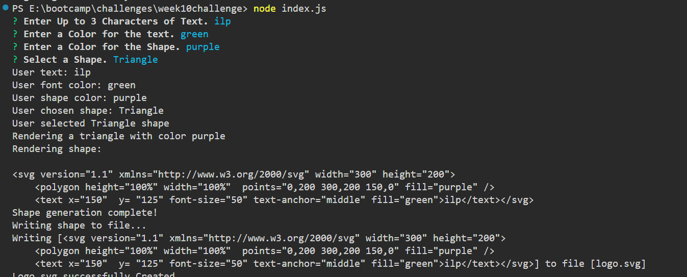

# Logo Generator

## Description

This is a command-line application designed to generate simple logos based on user input.

## Table of Contents

- [Screenshot](#screenshot)
- [Installation](#installation)
- [Usage](#usage)
- [License](#license)
- [Contributing](#contributing)
- [Tests](#tests)
- [Questions](#questions)

## Screenshot

## Installation

Fork from my Github

## Usage

Generating simple logos with max 3 characters of text

## License

https://opensource.org/licenses/ISC

This project is licensed under the ISC License.

## Contributing

N/A

## Tests

Generating any shapes from circle to square to triangle, and jest tests.

## Questions

If you have any questions about this project, you can reach me at orion.m.cannon@gmail.com
or you can find me on GitHub at [OrionC11](https://github.com/OrionC11).
